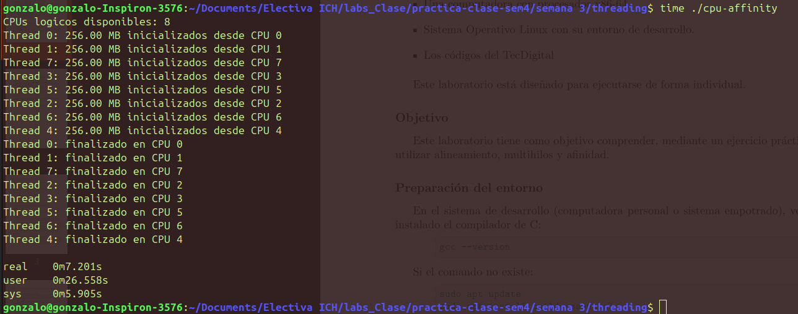
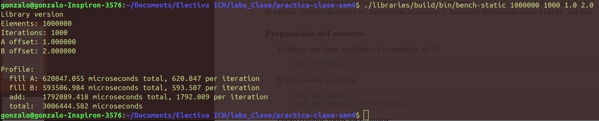
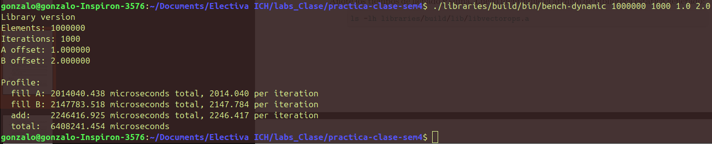

# Laboratorios 3 y 4 — Ejercicios A y B

En esta rama se puede ver la implementación y evaluación de diferentes técnicas relacionadas con programación paralela y construcción de programas en C.

En el **Laboratorio 3** se trabajó con ejecución multihilo, afinidad de CPU y paralelización mediante **OpenMP**, con el objetivo de observar cómo cambia el tiempo de ejecución al aumentar el número de hilos.

En el **Laboratorio 4** se trabajó con bibliotecas y métodos de enlazado, comparando el comportamiento de una versión enlazada mediante **biblioteca estática** y otra mediante **biblioteca dinámica**.

---

## Ejercicios realizados

### Lab 3 - Ejercicio A — Ejecución de `cpu-affinity`

Se compiló y ejecutó el programa `cpu-affinity`, modificando el número de hilos desde **1 hasta 8**, correspondientes a los 8 CPUs lógicos disponibles en la computadora.

Para cada ejecución se tomó como referencia el tiempo `real` reportado por el comando:

```bash
time ./cpu-affinity
```

Los resultados obtenidos fueron:

| Threads | Tiempo real (s) |
|--------:|----------------:|
| 1 | 3.372 |
| 2 | 3.476 |
| 3 | 4.040 |
| 4 | 4.800 |
| 5 | 3.958 |
| 6 | 5.835 |
| 7 | 8.464 |
| 8 | 7.201 |

Una de las ejecuciones puede observarse a continuación:



Las demás capturas utilizadas para realizar la comparación se encuentran en:

```text
practica-clase-sem4/result/
```

desde `1thread.png` hasta `7threads.png`.

---

### Lab 3 - Ejercicio B — Ejecución de `matmul_tiled_openmp` y `softmax_openmp`

Se compilaron y ejecutaron las versiones paralelas utilizando OpenMP:

```bash
./matmul_tiled_openmp N
./softmax_openmp N
```

donde `N` representa el número de hilos utilizados.

Se realizaron pruebas desde **1 hasta 8 hilos** y posteriormente se generaron gráficas con los tiempos obtenidos.

#### Matmul tiled OpenMP

| Threads | Tiempo (s) | Speedup | Eficiencia |
|--------:|-----------:|--------:|-----------:|
| 1 | 1.7450 | 1.00x | 100.0% |
| 2 | 0.8241 | 2.12x | 105.9% |
| 3 | 0.6225 | 2.80x | 93.4% |
| 4 | 0.5132 | 3.40x | 85.0% |
| 5 | 0.5484 | 3.18x | 63.7% |
| 6 | 0.4374 | 3.99x | 66.5% |
| 7 | 0.4014 | 4.35x | 62.1% |
| 8 | 0.6307 | 2.77x | 34.6% |


El mejor tiempo se obtuvo utilizando **7 hilos**, con aproximadamente **0.401 s**, frente a los **1.745 s** obtenidos utilizando solamente un hilo.

Esto representa un speedup aproximado de:

```text
S(7) = T(1) / T(7)

S(7) = 1.745 / 0.401 ≈ 4.35
```

por lo que el programa fue aproximadamente **4.35 veces más rápido** que la ejecución con un solo hilo.

---

#### Softmax OpenMP

| Threads | Tiempo (s) | Speedup | Eficiencia |
|--------:|-----------:|--------:|-----------:|
| 1 | 1.7232 | 1.00x | 100.0% |
| 2 | 1.2808 | 1.35x | 67.3% |
| 3 | 1.0992 | 1.57x | 52.3% |
| 4 | 1.0976 | 1.57x | 39.2% |
| 5 | 1.1415 | 1.51x | 30.2% |
| 6 | 1.0902 | 1.58x | 26.3% |
| 7 | 1.1111 | 1.55x | 22.2% |
| 8 | 1.8713 | 0.92x | 11.5% |


El menor tiempo medido se obtuvo con **6 hilos**, con aproximadamente **1.090 s**, mientras que utilizando un hilo se obtuvo un tiempo de **1.723 s**.

El speedup correspondiente fue:

```text
S(6) = 1.723 / 1.090 ≈ 1.58
```

por lo que el incremento de rendimiento fue considerablemente menor que en `matmul_tiled_openmp`.

---

### Lab 4 - Ejercicio A — Ejecución versión enlazada con biblioteca estática

Se ejecutó la versión enlazada mediante la biblioteca estática:

```bash
./libraries/build/bin/bench-static 1000000 1000 1.0 2.0
```

Los resultados obtenidos fueron:

| Operación | Tiempo total |
|---|---:|
| Fill A | 620847.055 µs |
| Fill B | 593506.984 µs |
| Add | 1792089.418 µs |
| **Total** | **3006444.582 µs** |

Por lo tanto, el tiempo total de ejecución medido fue aproximadamente:

```text
3.006 segundos
```



---

### Lab 4 - Ejercicio B — Ejecución versión enlazada con biblioteca dinámica

Posteriormente se ejecutó la versión enlazada mediante una biblioteca dinámica:

```bash
./libraries/build/bin/bench-dynamic 1000000 1000 1.0 2.0
```

Los resultados obtenidos fueron:

| Operación | Tiempo total |
|---|---:|
| Fill A | 2014040.438 µs |
| Fill B | 2147783.518 µs |
| Add | 2246416.925 µs |
| **Total** | **6408241.454 µs** |

El tiempo total medido fue aproximadamente:

```text
6.408 segundos
```



---

# Implementación

Todos los cambios fueron realizados siguiendo las recomendaciones, ejemplos y guía proporcionados por el profesor durante la clase.

Los principales archivos trabajados y desarrollados se encuentran en:

```text
practica-clase-sem4/
├── semana 3/
│   ├── threading/
│   └── scaling/
├── libraries/
└── result/
```

En:

```text
semana 3/threading/
```

se encuentran los códigos relacionados con `cpu-affinity` y `cpu-naive`.

En:

```text
semana 3/scaling/
```

se encuentran las implementaciones de `matmul_tiled_openmp` y `softmax_openmp`, junto con los archivos `.dat` que almacenan los tiempos medidos y las gráficas generadas.

Las gráficas fueron realizadas a partir de los datos obtenidos experimentalmente, siguiendo el procedimiento mostrado durante la clase y utilizando como apoyo las herramientas de IA integradas en VS para generar el código necesario para graficar los resultados.

Finalmente, en:

```text
libraries/
```

se encuentran las implementaciones utilizadas para comparar bibliotecas estáticas y dinámicas.

Las capturas de las ejecuciones realizadas se almacenaron en:

```text
result/
```

---

# Resultados

### Lab 3 - `cpu-affinity`

En este ejercicio debe tomarse en cuenta una característica importante del código: cada hilo trabaja con aproximadamente **256 MB de memoria**.

Por lo tanto, al modificar el número de hilos también cambia el volumen total de datos sobre el que trabaja el programa:

```text
1 hilo  →  256 MB
2 hilos →  512 MB
4 hilos → 1024 MB
8 hilos → 2048 MB
```

Esto hace que los tiempos de `cpu-affinity` no deban tratarse exactamente igual que los de `matmul_tiled_openmp` y `softmax_openmp`, ya que en estos últimos se utiliza el número de hilos para repartir una carga de trabajo, mientras que en `cpu-affinity` cada hilo adicional incorpora también su propia carga de memoria.

El resultado más importante:

```text
1 hilo  → 3.372 s
2 hilos → 3.476 s
```

Aunque la cantidad de memoria trabajada pasa de 256 MB a 512 MB, el tiempo `real` aumenta solamente de 3.372 s a 3.476 s. Esto demuestra que inicialmente los CPUs adicionales permiten ejecutar trabajo en paralelo sin que el tiempo total aumente en la misma forma que la cantidad de trabajo.

Este comportamiento se relaciona con el concepto de **thread affinity** visto en clase. Se fija cada hilo sobre un CPU lógico determinado y así se evita que el sistema operativo cambie constantemente la tarea de un núcleo a otro.

Sin embargo, los tiempos dejan de mantenerse cercanos al aumentar la cantidad de hilos:

```text
3 hilos → 4.040 s
4 hilos → 4.800 s
5 hilos → 3.958 s
6 hilos → 5.835 s
7 hilos → 8.464 s
8 hilos → 7.201 s
```

Affinity ayuda a mantener cada tarea asociada a un CPU, pero no significa que al aumentar los hilos el sistema vaya a escalar de manera indefinida. Como se estudió para sistemas multinúcleo, los núcleos poseen recursos propios, pero también utilizan niveles compartidos de la jerarquía de memoria y una memoria principal común.

Además, en clase se plantea que el tiempo de una carga de trabajo no depende únicamente del tiempo de cómputo, sino también de la comunicación y del acceso a los datos. En este ejemplo, conforme aumenta el número de hilos también aumenta el volumen total de memoria utilizado, por lo que el comportamiento deja de ser cercano al observado con uno o dos hilos.

Al incrementar los hilos también se está incrementando la cantidad total de trabajo. Por esta razón, obtener una fracción `p` a partir de estos tiempos puede dar una interpretación que no representa correctamente este laboratorio.

El resultado permite observar principalmente el comportamiento del programa al fijar cada hilo a un CPU y cómo cambia el tiempo conforme aumenta simultáneamente el paralelismo y la carga total.

---

### Lab 3 - `matmul_tiled_openmp`

`matmul_tiled_openmp` presentó el mejor escalamiento de los programas evaluados.

El tiempo disminuyó desde:

```text
1 hilo → 1.745 s
```

hasta:

```text
7 hilos → 0.401 s
```

obteniendo:

```text
S(7) ≈ 4.35
η(7) = 4.35 / 7 ≈ 0.621 = 62.1 %
```

De acuerdo con la Ley de Amdahl:

```text
S(N) = 1 / (s + p/N)
p = 1 - s
```

utilizando el resultado de 7 hilos:

```text
4.35 = 1 / (s + (1-s)/7)
```

se obtiene aproximadamente:

```text
s ≈ 0.102
p ≈ 0.898
```

Por lo tanto, a partir de esta medición puede estimarse que alrededor del **89.8 % de la carga observada es paralelizable**, mientras que aproximadamente un **10.2 % corresponde a la parte que limita el escalamiento** según el modelo de Amdahl.

Esto concuerda con la gráfica obtenida, ya que agregar hilos produce una reducción importante del tiempo durante buena parte del laboratorio.

Sin embargo, el comportamiento deja de mejorar con 8 hilos:

```text
7 hilos → 0.401 s, eficiencia = 62.1 %
8 hilos → 0.631 s, eficiencia = 34.6 %
```

Este resultado puede compararse directamente con el criterio visto en clase: una carga de trabajo no debería escalarse más allá del **codo de la gráfica de escalamiento**.

En este caso, **7 hilos constituye el mejor punto medido**:

- entrega el menor tiempo de ejecución;
- obtiene el mayor speedup observado;
- mantiene una eficiencia superior al 50 %.

Al pasar a 8 hilos ocurre lo contrario: el tiempo aumenta y la eficiencia cae a 34.6 %. Por lo tanto, añadir el octavo hilo no solamente aporta poco rendimiento, sino que empeora la ejecución respecto a 7 hilos.

---

### Lab 3 - `softmax_openmp`

`softmax_openmp` presentó un comportamiento considerablemente diferente.

Los primeros hilos sí producen una mejora:

```text
1 hilo → 1.723 s
2 hilos → 1.281 s
3 hilos → 1.099 s
```

pero después de 3 hilos el tiempo prácticamente deja de disminuir:

```text
3 hilos → 1.099 s
4 hilos → 1.098 s
5 hilos → 1.142 s
6 hilos → 1.090 s
7 hilos → 1.111 s
```

Aunque el menor tiempo absoluto se obtuvo con 6 hilos:

```text
6 hilos → 1.090 s
```

el speedup fue de solamente:

```text
S(6) ≈ 1.58
```

y la eficiencia:

```text
η(6) = 1.58 / 6 ≈ 26.3 %
```

Utilizando este punto para realizar una estimación con la Ley de Amdahl:

```text
1.58 = 1 / (s + (1-s)/6)
```

se obtiene aproximadamente:

```text
s ≈ 0.559
p ≈ 0.441
```

Por lo tanto, el resultado observado corresponde aproximadamente a un **44.1 % de proporción paralelizable** según el modelo de Amdahl.

Esta proporción es considerablemente menor que el aproximadamente 89.8 % obtenido para `matmul_tiled_openmp`, lo cual permite entender por qué ambos programas responden de manera tan diferente al incremento en el número de hilos.

La comparación más importante aparece al aplicar el criterio de eficiencia estudiado en clase:

| Threads | Tiempo (s) | Eficiencia |
|--------:|-----------:|-----------:|
| 2 | 1.2808 | 67.3% |
| 3 | 1.0992 | 52.3% |
| 4 | 1.0976 | 39.2% |
| 6 | 1.0902 | 26.3% |

El cambio de 3 a 6 hilos reduce el tiempo solamente de:

```text
1.0992 s → 1.0902 s
```

una diferencia de aproximadamente:

```text
0.009 segundos
```

Sin embargo, la eficiencia cae de:

```text
52.3 % → 26.3 %
```

Por lo tanto, aunque **6 hilos obtienen el menor tiempo numérico**, utilizando el criterio visto en clase el punto de escalamiento más razonable se encuentra alrededor de **3 hilos**, donde todavía se mantiene una eficiencia superior al 50 % y el tiempo ya está prácticamente en el mínimo de la gráfica.

Este comportamiento representa claramente el **codo de la gráfica de escalamiento**. Después de ese punto se agregan más recursos de procesamiento, pero la mejora obtenida es prácticamente nula.

El caso de 8 hilos lo hace aún más evidente:

```text
1 hilo → 1.723 s
8 hilos → 1.871 s
```

con:

```text
S(8) ≈ 0.92
η(8) ≈ 11.5 %
```

En este punto ya no existe aceleración: la ejecución con 8 hilos tarda más que la ejecución con un único hilo.

Por lo tanto, los resultados de `softmax_openmp` muestran directamente el límite descrito por la Ley de Amdahl y por el criterio de escalamiento visto en clase: **agregar más elementos de procesamiento después del codo no implica obtener mayor rendimiento**.

---

### Lab 4 - Biblioteca estática vs dinámica

La comparación directa obtenida fue:

| Operación | Estática | Dinámica | Relación |
|---|---:|---:|---:|
| Fill A | 620847 µs | 2014040 µs | Dinámica 3.24x |
| Fill B | 593507 µs | 2147784 µs | Dinámica 3.62x |
| Add | 1792089 µs | 2246417 µs | Dinámica 1.25x |
| **Total** | **3006445 µs** | **6408241 µs** | **Dinámica 2.13x** |

En esta ejecución, la biblioteca estática obtuvo:

```text
3.006 s
```

mientras que la biblioteca dinámica obtuvo:

```text
6.408 s
```

La relación entre ambas mediciones es:

```text
6.408 / 3.006 ≈ 2.13
```

Por lo tanto, **para las ejecuciones realizadas en este laboratorio**, la versión dinámica tardó aproximadamente 2.13 veces el tiempo de la versión estática.

Además, la versión estática obtuvo menores tiempos en las tres operaciones medidas:

```text
Fill A
Fill B
Add
```

La diferencia fue particularmente grande en `Fill A` y `Fill B`, mientras que en `Add` fue menor:

```text
Add estática  → 1.792 s
Add dinámica  → 2.246 s
```

Por lo tanto, el resultado experimental permite concluir que la versión estática presentó mayor rendimiento en esta prueba.

---

### Resultado

Los resultados obtenidos permiten distinguir claramente el comportamiento de cada carga de trabajo.

`cpu-affinity` demuestra el objetivo de fijar cada hilo a un CPU lógico para evitar migraciones de la tarea y cambios innecesarios de contexto. Con pocos hilos el tiempo se mantiene relativamente estable aun cuando aumenta la carga total, pero este comportamiento se degrada conforme se utilizan más CPUs.

`matmul_tiled_openmp` presenta el mejor escalamiento. Con 7 hilos se obtiene un speedup aproximado de **4.35x**, una eficiencia de **62.1 %** y una proporción paralelizable estimada mediante Amdahl de aproximadamente **89.8 %**. El octavo hilo reduce la eficiencia hasta 34.6 % y empeora el tiempo de ejecución, por lo que queda más allá del punto de escalamiento conveniente.

`softmax_openmp` tiene un límite mucho más temprano. Su mejor tiempo se obtiene con 6 hilos, pero la eficiencia es solamente de **26.3 %**. Según el criterio visto en clase, el punto más adecuado aparece alrededor de **3 hilos**, donde la eficiencia todavía es **52.3 %** y el tiempo es prácticamente igual al mínimo conseguido con 6.

Finalmente, en el Lab 4 la versión con biblioteca estática obtuvo **3.006 s**, mientras que la dinámica obtuvo **6.408 s**, por lo que la versión estática fue la de mejor rendimiento en las mediciones realizadas.

---

# Uso de IA

En este laboratorio el uso de IA se centró únicamente en la generación de las gráficas, siguiendo el ejemplo realizado en clase por el profesor y aprovechando las herramientas integradas en Visual Studio Code.

También se utilizó como apoyo para dar formato y estilo a este `README.md`.